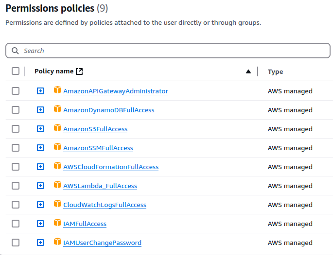

## Prerequisites
Before deploying and using this API, ensure you have the following:

* An active AWS account.
* AWS CLI configured with appropriate credentials.
* Node.js and npm installed (for deploying Lambda functions written in JavaScript).
* Postman application installed (for importing and using the provided API collections).

## Deployment
1. While in the project root, open the console and enter the following command:
   ```bash
   aws cloudformation create-stack --stack-name LambdaS3BucketStack --template-body file://s3_cloudformation.yaml --capabilities CAPABILITY_NAMED_IAM
   ```

2. Check the successful deployment of S3 in the AWS Management Console. Note down the Bucket name, as it will be needed for further use. Alternatively, you can view all created S3 Buckets using the command:
   ```bash
   aws s3 ls
   ```

3. After the S3 bucket is created, upload the zip files for the Lambda functions to S3. Enter the following commands sequentially:
   ```bash
   aws s3 cp lambda/registerUser.zip s3://prod-lambda-code-556240469601-us-east-1/registerUser.zip
   aws s3 cp lambda/loginUser.zip s3://prod-lambda-code-556240469601-us-east-1/loginUser.zip
   aws s3 cp lambda/getUserInfo.zip s3://prod-lambda-code-556240469601-us-east-1/getUserInfo.zip
   ```

4. Verify in the AWS Management Console that the files have been uploaded to the S3 Bucket.

5. Go to IAM, create a user, and add the following policies to it for deployment.


6. For the following steps, it is necessary to use the previously noted S3 Bucket name, as well as a JWT Secret string for the JWT token.
   To generate the Secret string:
   - Open the console.
   - Use the command: `node -e "console.log(require('crypto').randomBytes(32).toString('hex'))"`
   - Copy the generated string.

7. After you have the bucket name and the generated secret string for JWT, enter the following command in the terminal:
   ```bash
   aws cloudformation create-stack --stack-name UserManagementStack --template-body file://cloudformation.yaml --parameters ParameterKey=JWTSecret,ParameterValue="{YOUR_JWT_SECRET_STRING}" ParameterKey=LambdaCodeBucket,ParameterValue="{YOUR_S3_BUCKET_NAME}" --capabilities CAPABILITY_NAMED_IAM
   ```
   where `{YOUR_S3_BUCKET_NAME}` - insert the name of the created S3 Bucket, `{YOUR_JWT_SECRET_STRING}` - insert the generated secret string.

8. Check the deployment status in the AWS console.

9. Go to API Gateway and find out the URL to access the API.

10. After successful deployment, test using Postman. There are JSON files in the Collections folder that can be imported into Postman. But before that, you should:
   In this section of the JSON collection file:
   ```json
   "url": {
   	"raw": "https://my-aws-api.com/user-info",
   	"protocol": "https",
   	"host": [
   		"my-aws-api",
   		"com"
   	],
   	"path": [
   		"user-info"
   	]
   },
   ```
   9.1 In the "raw" parameter, change `my-aws-api.com` to the API Gateway URL.
   9.2 In the "host" parameter, change the first object to the API Gateway URL without the `.com` domain.
   9.3 Save the updated JSON.

11. After that, the JSON can be imported into Postman and the API can be tested.
